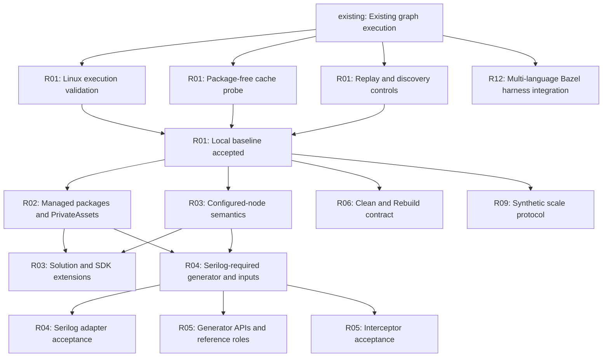
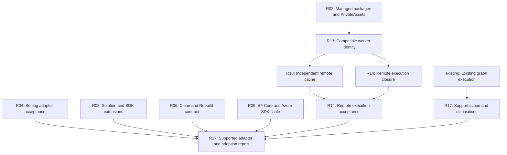
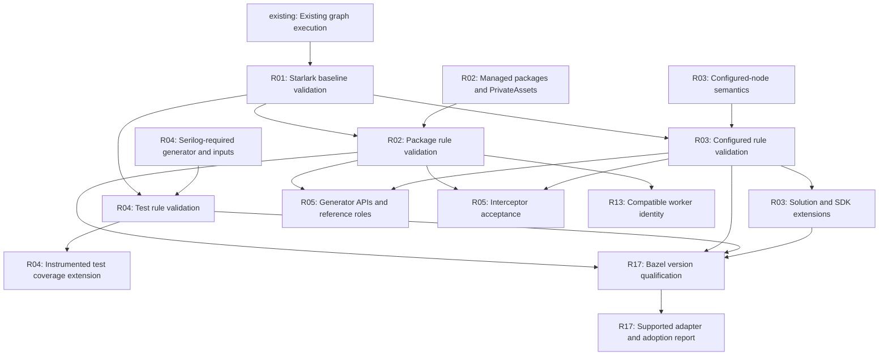

# Parallel roadmap dependency graph

This graph decomposes [R01–R17](roadmap.md) into work packages. The source is
[roadmap-graph.json](roadmap-graph.json); node IDs are stable within this plan.
Acceptance state is recorded in the JSON and the
[first parallel batch findings](parallel-tracks-findings.md). `base`, `linux`, `cache`, `handoff` and `local` have passing evidence; downstream
`packages` and the bounded `configured` slice now pass on native macOS ARM64.
Further Linux validation is [deferred by request](platform-validation-scope.md);
The R04 input slice and Serilog library build/mutation/relocation acceptance now
pass; unchanged approval Test also passes native macOS mutation and recovered-artifact execution.
The package/configuration/test-rule gates and [three-repetition measurements](serilog-performance-findings.md)
now complete the selected active macOS R04 acceptance. Linux and useful performance
at scale remain open. Other nodes remain
open until their own scoped acceptance lanes pass. Arrows are acceptance prerequisites, not a
requirement to delay source inspection, contract design or isolated implementation.
Every incoming solid edge must pass before accepting that downstream slice.
The added `starlark_core` baseline now has [native macOS and Linux ARM64 acceptance](starlark-core-findings.md).

The graph covers initial slices, not every optional extension. Scope notes in the
node table state additional prerequisites for native SQLite, WASM AOT, IDE and
remote real-project extensions. Refine broad later nodes before scheduling their
implementation. Never infer support for an omitted configuration from an edge.

## Dependency views

Boundary nodes repeat across views with the same IDs. Each arrow is represented
in the JSON; diagrams contain no additional implied ordering.

### Foundation and first pilots

### Application and platform tracks

```mermaid
flowchart TD
  packages["R02: Managed packages and PrivateAssets"]
  configured["R03: Configured-node semantics"]
  inputs["R04: Serilog-required generator and inputs"]
  serilog["R04: Serilog adapter acceptance"]
  generators["R05: Generator APIs and reference roles"]
  tasks["R06: Source-built task handoff"]
  pack["R06: Pack and independent consumers"]
  lifecycle["R06: Clean and Rebuild contract"]
  git_tasks["R06: Git-versioning task pilot"]
  restore["R07: Broader restore and asset flow"]
  publish["R07: Ordinary publish contracts"]
  asset_pack["R07: PrivateAssets through Pack"]
  native_assets["R07: Native and target runtime closure"]
  aot["R08: Native AOT executable"]
  scale_synthetic["R09: Synthetic scale protocol"]
  scale_real["R09: EF Core and Azure SDK scale"]
  web["R10: Web and Blazor slices"]
  desktop["R11: Desktop Framework and languages"]
  languages["R12: Multi-language Bazel harness integration"]
  aspire["R12: Aspire composition acceptance"]
  design_time["R15: Design-time and IDE slices"]
  runtime_managed["R16: dotnet/runtime managed slice"]
  runtime_native["R16: dotnet/runtime native expansion"]
  generators --> tasks
  tasks --> pack
  tasks --> git_tasks
  native_assets --> git_tasks
  packages --> restore
  configured --> restore
  packages --> publish
  configured --> publish
  restore --> asset_pack
  pack --> asset_pack
  publish --> native_assets
  generators --> aot
  native_assets --> aot
  serilog --> scale_real
  generators --> scale_real
  restore --> scale_real
  scale_synthetic --> scale_real
  tasks --> web
  publish --> web
  generators --> web
  configured --> desktop
  tasks --> desktop
  native_assets --> desktop
  serilog --> aspire
  languages --> aspire
  inputs --> design_time
  lifecycle --> design_time
  configured --> runtime_managed
  tasks --> runtime_managed
  restore --> runtime_managed
  scale_synthetic --> runtime_managed
  runtime_managed --> runtime_native
  native_assets --> runtime_native
```

### Remote workers and release

The stable node ID `languages` now means integration of existing Bazel rules into
a multi-language harness. It does not schedule development of new Python or
TypeScript build rules. This scope correction leaves dependency edges unchanged.

## Validation work packages

The [milestone ownership table](roadmap.md#validation-ownership-and-remaining-gates)
assigns S01–S05 to deliverables and exit criteria. These additional nodes remain
open and preserve historical acceptance states. Their all-of joins are explicit
in the JSON; qualification uses the active macOS lane with Linux deferred.

Existing incoming edges from the other views still apply. `starlark_core` now
passes on native macOS and local Linux ARM64. The package, selected-configuration
and test-rule extensions now pass [native macOS qualification](r02-r04-validation-findings.md).
New generator, interceptor and remote-worker slices must extend these assertions
and satisfy their remaining feature prerequisites.
Other feature packages extend applicable assertions as part of their own exit
criteria; they do not create retroactive edges into completed historical nodes.
Both local-only and full releases require `bazel_compatibility`.

## What can start now

R01 is accepted at `c384671` on both native lanes. R02 managed packages and
the selected R03 configured-node slice now satisfy the active macOS prerequisites.
Linux validation is deferred. The completed R04 library batch delivered the
following contracts. The additional Starlark package/configuration/test-rule
nodes now pass [qualification](r02-r04-validation-findings.md), following the
completed [shared baseline](starlark-core-findings.md). R05 generator/reference-role
work can proceed, with each new scenario extending the applicable assertions.
The existing feature contracts are:

| Work package | Immediate deliverable | Primary ownership |
| --- | --- | --- |
| Package policy | Evaluated pinned package requests and narrowly qualified analyzer/build payloads | Restore validation, package staging and action package checks |
| Compiler inputs | Resolved analyzers, signing key, resources and shared imports without compilation during discovery | Graph exporter and discovery acceptance |
| Serilog library | Ordinary/native parity, mutations and producer-free relocated cache recovery | Pinned pilot harness and evidence |

The [first parallel batch findings](parallel-tracks-findings.md) retain the earlier
R01 work. Lifecycle characterization and synthetic-scale smoke results do not
establish their full production or performance milestones.

After `local` passes, package integration, configured-node work, lifecycle tests
and synthetic scale can run concurrently. After `inputs` passes, Serilog,
reference-role/generator tests and interceptor tests can proceed separately.
After `worker_identity`, remote-cache setup and execution-worker closure can
proceed together; remote execution acceptance joins both results.

## Coordination and integration

- Use a separate worktree for each change. One owner changes shared runner,
  preparation and replay interfaces at a time; other tracks consume the agreed
  contract and bring fixture-specific changes independently.
- Land compatible schema/interface changes first. Keep additive report changes
  versioned; do not let several probes independently redefine the same fields.
- `cache` and `handoff` are logically parallel but share instrumentation. Agree
  event/report shapes first, then serialize edits to shared files. Linux failures
  feed that same owner instead of creating competing runner fixes.
- Keep contracts/test code scoped to their track; the integration owner updates
  shared roadmap/status tables after evidence is available.
- Native sandbox and performance runs need controlled resources. Parallel code
  work is useful; simultaneous benchmarks are not comparable evidence. Reserve
  a worker for C16 measurements and document other execution contention.
- Remote setup/inventory may begin now; enabling remote cache/execution requires
  its separate identity/closure gates. Keep current local-only flags until then.

## Work package contracts

The dependencies below are all-of gates. `base` is the existing implementation,
not a claim that Linux execution or generated-graph caching already passes.

| ID | Milestone | Deliverable and boundary |
| --- | --- | --- |
| `base` | existing | Implemented macOS package-free slice; source checkpoint 6bd2525. R01 acceptance is recorded below. |
| `linux` | R01 | Run current graph execution/replay acceptance in native Linux CI; preserve sandbox strategy. |
| `cache` | R01 | Implement existing package-free report cases, edit sets and relocated disk-cache recovery. |
| `handoff` | R01 | Add C13 boundary controls, C14 new inputs, concurrent baseline builds and interrupted publication tests. |
| `local` | R01 | Both native lanes pass R01; full package-bearing cache suite is not yet complete. |
| `packages` | R02 | Generated graph package closure, private-asset default/all/none, upgrade/stale controls and entire cache suite. |
| `configured` | R03 | Inner/outer builds and executable AdditionalProperties/GlobalPropertiesToRemove fixtures; prerequisites for Serilog. |
| `entrypoints` | R03 | F13/F14 separately qualified entry-point formats and package/local SDK resolution. |
| `inputs` | R04 | Required package generator/analyzer, signing, resource and shared-import contracts, tested in small fixtures. |
| `serilog` | R04 | P01 baseline parity, API/logging and reference-consumer oracles, real generator mutation, approval Build/Test, relocation and repeated descriptive timings on native macOS; Linux qualification deferred. |
| `generators` | R05 | P02/P16 plus small API/delivery/diagnostic fixtures, framework combinations and additional files. |
| `interceptors` | R05 | P14 execution oracle, compiler identity and call-site/relocation mutations; does not wait for all P02/P16 results. |
| `tasks` | R06 | P05 source-task closure and scheduling with producer-free consumer; any extra native requirement adds an explicit dependency. |
| `pack` | R06 | P05 task packages and P16 analyzer package consumption; separate Pack/restore/Build/Test boundaries. |
| `lifecycle` | R06 | Define output ownership and command semantics; test deletion, config isolation and recovery as supported configs expand. |
| `git_tasks` | R06 | P17 selected task/tool closure and controlled Git cases; inventory native dependencies before fixing the slice. |
| `restore` | R07 | F04 categories/conditions/conflicts/locks and metadata-only invalidation; packaged dependency checks join pack separately. |
| `publish` | R07 | Named F06 distribution modes and F07 output/runtime oracle; qualify modes independently and add feature-specific prerequisites. |
| `asset_pack` | R07 | Inspect generated nuspec metadata and test independent package consumers for selected asset-flow controls. |
| `native_assets` | R07 | F03 declared assets/tools and selected C15 target pairs; wider host closure is separately required for remote execution. |
| `aot` | R08 | P08 native publish/test with declared AOT compiler/linker/runtime packs; no dependency on interceptor acceptance. |
| `scale_synthetic` | R09 | 10/100/1000 configured nodes, independent cache states, baseline timings and process-tree memory. |
| `scale_real` | R09 | P03/P06 selected subtrees; add native_assets edge if SQLite/native slice is selected. |
| `web` | R10 | P04/P09/P18; independent server/WASM browser oracles. WASM AOT extension additionally requires native_assets and its workloads. |
| `desktop` | R11 | Selected P05/P10–P13/F01/F02 slices with Windows and other runtime prerequisites; do not require every lane for the first result. |
| `languages` | R12 | Integrate existing rules_python and rules_js/rules_ts with the .NET adapter: shared targets, runfiles, tests and cache evidence. Pin compatible rule/tool versions; do not implement new language rules. Independent of .NET generator work. |
| `aspire` | R12 | P07 composes existing-rule Python/TypeScript targets and .NET outputs through the shared harness; prove fresh-service message flow without build/restore at launch. Add task/publish prerequisites only if needed. |
| `worker_identity` | R13 | Declare compatible-worker inputs, toolchain and host assumptions; resolve relevant undeclared inputs. |
| `remote_cache` | R13 | bazel-remote plus diamond on independent workers; Serilog extension adds serilog prerequisite. |
| `worker_closure` | R14 | Provision/pin Buildbarn services and full execution tool/runtime closure for diamond; no local fallback. |
| `remote_exec` | R14 | Force uncached diamond identities onto worker and verify output/missing-input failures; extend to Serilog after serilog. |
| `design_time` | R15 | Start target output contracts; actual IDE/generated-source/desktop extensions add relevant generators/desktop prerequisites. |
| `runtime_managed` | R16 | Pinned bootstrap and selected managed subtree; inventory may add generator/package features before execution. |
| `runtime_native` | R16 | Selected native shims/build and target oracle; remote variant additionally requires remote_exec. |
| `dispositions` | R17 | Maintain named support/rejection/deferral decisions for every P/G/F category; final sign-off uses current evidence and explicitly accounts for unfinished tracks. |
| `starlark_core` | R01 | S01 formatting/lint and applicable S02 helper tests; S03 explicit/diamond build-rule analysis, S04 generated baseline/escaping/determinism and S05 SDK/runtime repository controls. Existing behavior remains independently tested. |
| `starlark_packages` | R02 | Extend S03/S04 to per-consumer package/restore inputs and generated package targets; retain full cache, PrivateAssets, upgrade and rejection controls for the qualified slice. |
| `starlark_configured` | R03 | Extend S03/S04 to selected configured identities, output separation, direct edges versus replay closure, discovery refresh and deterministic generated labels. Broader entry-point SDK checks belong to entrypoints. |
| `test_coverage` | R04 | Planned collector/adapter and transitive PDB closure; instrumented execution after build recovery and source-mapped coverage reports. Requires `starlark_tests`; explicit release disposition. |
| `starlark_tests` | R04 | S03/S04 graph_test analysis, runfiles/data hashes, expected failures and generated test targets; native expected-count/TRX evidence and forced test execution after build-cache recovery. |
| `bazel_compatibility` | R17 | Pin supported Bazel/toolchain combinations and run applicable S01-S05 plus behavioral regressions and upgrade invalidation. Required for local-only and full releases; version-matrix framework adoption is optional. |
| `release` | R17 | Full local/remote endpoint; release checklist also verifies documentation, reproducible installs and versioned contracts. Broad optional tracks can be deferred explicitly. |

## Endpoint and optional tracks

The Starlark and version-qualification additions are mandatory for release; they
are not optional portfolio dispositions. S02 may be inapplicable where no
substantial pure helper exists, with the reason recorded rather than a fictitious pass.

`release` is the full local-and-remote endpoint defined by R17. A local-only
release may be cut earlier and must be labeled accordingly. Application/platform
tracks without an edge to `release` are not silently complete: `dispositions`
records measured support, known limitations or explicit deferral for every one.
Final scope sign-off happens at release using current evidence, even though the
support matrix can be prepared earlier. If a track becomes promised release
scope, add it as a required dependency rather than relying on prose.

This graph deliberately allows remote validation before web/desktop/Aspire or the
full runtime repository. Individual workload extensions must still pass local
acceptance and their own remote closure tests. No timeline or critical-path
duration is claimed until work packages have estimates.

## Issue-review acceptance addendum

The [upstream issue plan](rules-dotnet-issue-plan.md) attaches concrete regression
cases to existing node owners without reopening historical measured slices.
The JSON DAG additionally defines `test_coverage` (R04), requiring `starlark_tests`.
It covers collector/adapter and transitive PDB inputs, forced instrumented execution
after recovery, and source-mapped reports. This extension is planned; release scope
must explicitly accept or defer it. Fable/source-provider support is also explicitly
deferred in the review. Neither is silently counted as existing test/language support.
